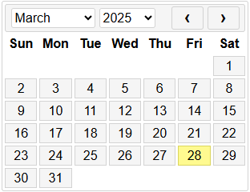
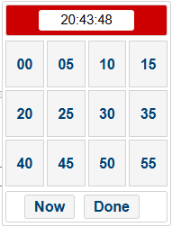
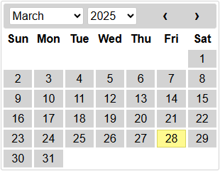

# TimeCraftJs

TimeCraftJs provides a user-friendly date/time picker component in vanilla JavaScript.
Ideal for all web-based applications, this library simplifies interaction using date/time when working with html elements.

This library started as a small project and gradually evolved into something larger, driven by the need to move away from external dependencies like jQuery for something as simple as a date/time picker. Built using HTML Web Components, it ensures complete isolation from external stylesheets, preventing conflicts with frameworks like Bootstrap that often interfere with traditional pickers. Sometimes, all we need is a lightweight, efficient solution in pure vanilla JavaScript, without the overhead of massive libraries when we're only using a small fraction of their features.

If you encounter any issues, have suggestions for improvements, or would like to contribute ideas, feel free to reach out! Your feedback is invaluable in making this library even better. You can contact me at [dbnunesg40@hotmail.com], and I'll do my best to respond as soon as possible. Contributions, bug reports, and feature requests are always welcome!

To view a live demo, click [here](https://dnunes40.github.io/TimeCraftJs).

## Technologies Used

- JavaScript
- ES6 (ECMAScript 2015)
- Web Components

## Using The Library

1. Download the library TimeCraftJs.min.js
2. Add it to your project
3. Link it to your html page using HTML &lt;style&gt; element
4. Assuming you have your html element target, your script should look like this:

```javascript
window.onload = function () {
  TimeCraftJs.datepicker(".selector");

  TimeCraftJs.datetimepicker(".selector");

  TimeCraftJs.timepicker(".selector");
};
```

## datepicker defaults

```javascript
TimeCraftJs.datepicker(".selector", {
  format: "DD/MM/yyyy",
  enableWeekend: true,
  language: "en-GB",
  leftOffset: 0,
  topOffset: 0,
  scale: 1,
  showOtherDays: false,
  startMonday: false,
  theme: 1,
  zIndex: 1,
  events: [],
  startDate: (new Date() - 2 years),
  endDate: (new Date() + 2 years),
  onSelected: null,
  onClosed: null
});
```

## datetimepicker defaults

```javascript
TimeCraftJs.datetimepicker(".selector", {
  format: "DD/MM/yyyy HH:mm:ss",
  enableWeekend: true,
  language: "en-GB",
  leftOffset: 0,
  topOffset: 0,
  scale: 1,
  showOtherDays: false,
  startMonday: false,
  theme: 1,
  zIndex: 1,
  events: [],
  startDate: (new Date() - 2 years),
  endDate: (new Date() + 2 years),
  menu: {
    show: true,
    done: "Done",
    now: "Today"
  },
  hour24: true,
  showHours: true,
  showMinutes: true,
  showSeconds: true,
  onSelected: null,
  onClosed: null
});
```

## timepicker defaults

```javascript
TimeCraftJs.timepicker(".selector", {
  format: "HH:mm:ss",
  language: "en-GB",
  leftOffset: 0,
  topOffset: 0,
  scale: 1,
  theme: 1,
  zIndex: 1,
  menu: {
    show: true,
    done: "Done",
    now: "Now",
  },
  hour24: true,
  showHours: true,
  showMinutes: true,
  showSeconds: true,
  onSelected: null,
  onClosed: null,
});
```

## Date/time supported formats

Examples: `{format: "dd-MMM-yyyy"}`, `{format: "dd-MMM-yyyy HH:mm:ss"}` or `{format: "HH:mm:ss"}`

**Day**

- **"dd"** Two digit ex: 01, 02, 09, 10, etc..

- **"d"**- One digit ex: 1, 2, 9, 10, etc..

**Month**

- **"MMMM"** Full name- ex: "January"

- **"MMM"**- Short name ex: "Jan"

- **"MM"**- Two digit ex: 01 (January)

- **"M"**- One digit ex: 1 (January)

**Year**

- **"yyyy"**, **"yy"** Four digit ex: 1970 - 2024

**Hour**

- **"hh"** Two digit ex: 08

- **"h"**- One digit ex: 8

**Minute**

- **"mm"** Two digit ex: 08

- **"m"**- One digit ex: 8

**Second**

- **"ss"** Two digit ex: 08

- **"s"**- One digit ex: 8

## 24/12 hour format

By default, the format is set to 24 hours. To enable the 12-hour format, set the property `{hour24: false}`.

## Supported languages

Example: `{language: "pt-PT"}`

- **en-GB**
- **en-US**
- **pt-PT**
- **es-ES**
- **fr-FR**

## Supported themes

There are 5 different themes available. To make use of them, the theme property must be set to 1, 2, 3, 4 or 5.

Example: `{theme: 1}`

#### 1 - Muted Pearl (default)



#### 2 - Blush Red

   

#### 3 - Nature Green


#### 4 - Pastel Dream


#### 5 - Cloudy Slate



## Menu

The menu object has 3 properties to define:<br>
show: true/false; It defines if the menu is shown<br>
done: string;<br>
now: string;

now and done are defined automaticly based on selected language, but can be overwritten.

```javascript
TimeCraftJs.timepicker(".selector", {
  ...,
  menu: {
    show: true,
    done: "Done",
    now: "Now",
  }
});
```

## Callbacks

The `onSelected` and `onClosed` callbacks are available for all picker instances.

- `onSelected`: Triggered when a date/time is selected.
- `onClosed`: Triggered when the picker is closed.

```javascript
TimeCraftJs.datepicker(".selector", {
  ...,
  onSelected: (selector) => {
    //selector -> The element associated with the picker instance
  },
  onClosed: (selector) => {
    //selector -> The element associated with the picker instance
  }
});
```

## Events

The events property is an array containing objects, each with two properties: date and message, as shown below.

```javascript
TimeCraftJs.datepicker(".selector", {
  ...,
  events: [
    {
      date: new Date(2025, 2, 12),
      message: "This is an event message."
    },
    {
      date: "12 3 2025",
      message: "This is another event message."
    }
  ]
});
```

Example:


## Global functions

```javascript
TimeCraftJs.datepicker(".selector", { ...options });

TimeCraftJs.timepicker(".selector", { ...options });

TimeCraftJs.datetimepicker(".selector", { ...options });

//Change the picker to one different from the currently selected one.
TimeCraftJs.update.datepicker(".selector", { ...options });

TimeCraftJs.update.timepicker(".selector", { ...options });

TimeCraftJs.update.datetimepicker(".selector", { ...options });

TimeCraftJs.destroy(".selector");

TimeCraftJs.open(".selector");
```
